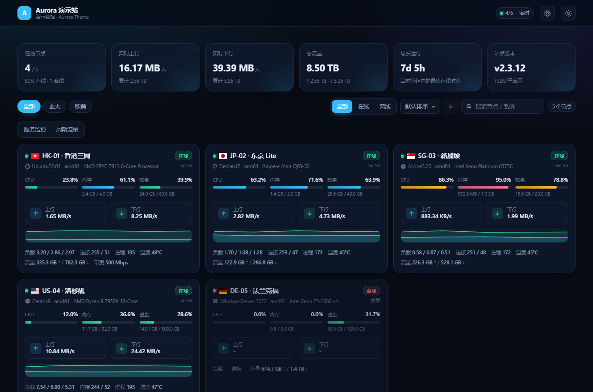

# Nezha Aurora

为 **哪吒监控 V2** 打造的现代用户前端主题，视觉风格参考 [CF-Server-Monitor](https://github.com/huilang-me/CF-Server-Monitor)：
卡片式节点总览、语义化进度条、实时网速、环形用量、历史曲线、服务监控与周期流量，深/浅双主题、移动端自适应。

项目直接消费哪吒 V2 官方用户前端 API，**不修改后端、不需要面板账号密码**，一套静态文件即可挂到现有面板上。



---

## 功能

| 模块 | 说明 |
| --- | --- |
| 节点总览 | 在线/离线统计、实时上下行速率、总流量、最长运行时长、站点版本 |
| 节点卡片 | 系统图标 + 地区旗帜、CPU/内存/磁盘进度条、上下行实时速率、负载、连接数、进程、温度、累计流量 |
| 分组与筛选 | 按分组标签切换、在线状态过滤、关键字搜索、7 种排序维度（含升降序） |
| 节点详情 | 四环用量总览、CPU/内存/交换/磁盘/网络速率/流量/负载/连接/进程/温度/GPU 历史曲线（1d / 7d / 30d） |
| 服务监控 | HTTP/TCP/ICMP 可用率、当前与平均延迟、成功/失败次数 |
| 周期流量 | 月流量规则进度条、剩余额度、重置时间 |
| 实时性 | WebSocket 推送（`/api/v1/ws/server`），断线自动重连（指数退避） |
| 外观 | 深/浅色主题持久化、面板自定义代码注入、Logo/背景图/描述/外链、强调色可配置 |
| 兼容 | 后端 V2 新老字段全容错；移动端卡片单列布局 |

---

## 后端接口

主题只使用哪吒 V2 公开的只读接口（与官方用户前端完全一致）：

| 接口 | 用途 |
| --- | --- |
| `GET /api/v1/setting` | 站点名称、语言、`custom_code`、版本、TSDB 开关 |
| `GET /api/v1/server-group` | 分组与节点归属 |
| `GET /api/v1/service` | 服务监控 + 周期流量 |
| `GET /api/v1/server/:id/metrics?metric=&period=` | 历史指标曲线 |
| `GET /api/v1/server/:id/service?period=` | 单节点服务监控延迟 |
| `WS /api/v1/ws/server` | 实时状态推送 `{ now, online, servers[] }` |

> 如果面板开启了 `force_auth`（强制登录），匿名访客将无法读取数据；此时需要在反代层为 `/api/v1` 放行或关闭该选项。

---

## 本地开发

```bash
npm install
npm run dev
```

默认把 `/api/v1` 与 WebSocket 代理到 `http://127.0.0.1:8008`。连接远端面板时在项目根目录新建 `.env.local`：

```dotenv
VITE_API_TARGET=https://status.example.com
VITE_WS_TARGET=wss://status.example.com
# 自签证书时启用
# VITE_API_INSECURE=1
```

### 无面板预览（内置演示数据）

想先看效果、或面板暂时不可达时，可以启动自带的演示服务（零依赖，内置模拟节点与实时推送）：

```bash
npm run build
npm run preview:demo        # 打开 http://127.0.0.1:8080
```

演示服务会托管 `dist/` 并用模拟数据实现 `/api/v1/*` 与 WebSocket，端口可通过 `node preview/demo-server.mjs 9000` 指定。

---

## 构建

```bash
npm run build          # 产物在 dist/
npm run build:theme    # 额外生成 dist.zip（哪吒主题发布包）
```

---

## 部署方式一：静态前端 + 反向代理（推荐）

前端请求同源的 `/api/`，因此必须由 Nginx / Caddy 把 `/api/v1`、`/dashboard` 与 Agent 上报通道转发给哪吒后端。

### 1. 上传静态文件

```bash
npm run build
mkdir -p /opt/nezha/aurora
cp -r dist/* /opt/nezha/aurora/
```

### 2. 配置反向代理

- 宿主机 Nginx：参考 [`deploy/nginx-site.conf`](deploy/nginx-site.conf)
- Caddy：参考 [`deploy/Caddyfile.example`](deploy/Caddyfile.example)

两份示例都包含三段关键路由：

1. `/proto.NezhaService/` → Agent 上报（gRPC h2c），**必须保留**
2. `/dashboard` 与 `/api/v1` → 面板后台、REST API、WebSocket
3. 其余请求 → Aurora 静态文件（SPA 回退到 `index.html`）

### 3. Docker 方式（可选）

```bash
docker build -t nezha-aurora .
docker run -d --name nezha-aurora --restart unless-stopped \
  -p 127.0.0.1:8081:80 nezha-aurora
```

容器只提供静态文件，仍需在外层反向代理中把 `/api/v1` 转发给面板。

---

## 部署方式二：编译进面板作为内置主题

哪吒 V2 的用户前端是**编译期嵌入**的（`//go:embed *-dist`），且 `user_template` 只能选择 `service/singleton/frontend-templates.yaml` 里列出的主题。
因此想把它做成面板后台里的“内置主题”，需要自行编译 Dashboard：

```bash
git clone https://github.com/nezhahq/nezha.git
cd nezha

# 1) 构建 Aurora 到 dashboard 的 *-dist 目录（目录名必须以 -dist 结尾）
npm --prefix /path/to/nezha-aurora run build -- --outDir "$PWD/cmd/dashboard/aurora-dist"

# 2) 在 service/singleton/frontend-templates.yaml 中追加一条
#    - path: aurora-dist
#      name: Aurora
#      author: you
#      version: v0.1.0
#      is_admin: false

# 3) 编译 Dashboard
mkdir -p cmd/dashboard/admin-dist cmd/dashboard/user-dist
go build -o dashboard ./cmd/dashboard
```

编译完成后启动面板，即可在「系统设置 → 主题」中选择 Aurora。

发布为可下载主题包时，需要把 `dist.zip`（内部顶层目录为 `dist/`）挂到 GitHub Release，并把 `repository` / `version` 填进 `frontend-templates.yaml`：

```bash
npm run build:theme     # 生成 dist.zip，已校验顶层 dist/ 与无 "_" 开头目录
```

---

## 主题自定义配置

Aurora 会像官方前端一样读取面板后台「用户前端自定义代码」注入的变量，同时提供一组主题专属配置（写在同一个输入框里）：

```html
<script>
  // —— 官方变量（与官方前端语义一致）——
  window.CustomLogo = "https://example.com/logo.png"
  window.CustomDesc = "by Aurora"
  window.CustomBackgroundImage = "https://example.com/bg.webp"
  window.CustomMobileBackgroundImage = "https://example.com/bg-mobile.webp"
  window.CustomLinks = '[{"name":"Telegram","link":"https://t.me/xxx"}]'
  window.ForceTheme = "dark"          // 仅作为默认值，用户仍可手动切换
  window.ForceShowServices = true     // 默认展开服务监控
  window.ShowNetTransfer = true

  // —— Aurora 专属配置 ——
  window.AuroraConfig = {
    accentColor: "#38bdf8",   // 强调色（覆盖主题默认渐变）
    showAdmin: true,          // 头部显示「进入管理面板」入口
    footerText: "My Status Page"
  }
</script>
```

> 背景图与外部字体/CDN 资源若被面板 CSP 拦截，请在面板后台把对应域名加入白名单。
> Aurora 默认引用了官方前端同款的 `fastly.jsdelivr.net` 旗帜与系统图标样式表；如需完全离线，可自行下载并改为本地引用。

---

## 目录结构

```
src/
├── api/           哪吒 V2 接口封装与类型定义
├── components/    卡片、进度条、环形图、图表、筛选栏等展示组件
├── store/         WebSocket 实时状态、站点设置、筛选排序状态
├── utils/         格式化、自定义代码注入、运行时长/流量/旗帜处理
├── views/         首页总览、节点详情
└── styles/        设计系统（CSS 变量 + 明暗主题）
deploy/            Nginx / Caddy 部署示例
scripts/           主题包打包脚本
```

---

## 常见问题

**页面一直显示“正在连接哪吒后端…”**
反向代理没有把 `/api/v1` 转发到面板，或面板开启了 `force_auth` 且访客未登录。

**图表没有数据**
历史曲线依赖 TSDB。面板未启用 TSDB 时曲线可能为空，页面会给出提示。

**node 详情页刷新后 404**
外层服务器缺少 SPA 回退规则，需要 `try_files $uri $uri/ /index.html`。

**WebSocket 一直重连**
反代缺少 `Upgrade` / `Connection` 头，或未设置 `Origin`（哪吒会做来源校验）。

---

## License

MIT
